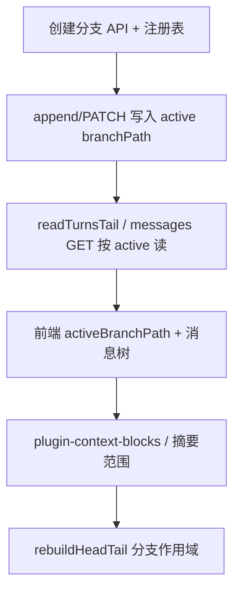

# 对话分支 — 设计与实现参考

> **状态（2026-06-23）**：**S1–S5 + 前端分支 UI + DELETE 已落地**；§9.3 审计遗留（含第三轮深树性能、`rollbackDeleteBranchRegistry`）已关闭；**persist SSE 增量 patch `turnId`**、**分支树 from/to/total 副标题**（2026-06-23）。集成脚本在 `server/src/integration/`。  
> **读者**：后续做「从此处分支继续」、消息树、分支切换的 Agent / 开发者。  
> **关联**：`DOC/03` §6.1–§6.4、§7.2–§7.3、§14.5；`DOC/08` §1.2；`DOC/15` §0。

---

## 1. 产品语义

### 1.1 Swipe 与分支

| 概念 | 存储 | 说明 |
|------|------|------|
| **Swipe（重新生成）** | 同 turn 内 `receives[]` + `activeReceiveIndex` | 同一轮多次模型输出，**不**新建目录 |
| **分支（Branch）** | `meta.links.branches` + 子目录 `branch*/` | 从某 `turnId`（可选 `forkMessageId`）**另起一条对话线** |

用户显式「从某条消息分叉」时才写入 branch；不得与 swipe 混用同一存储路径。

### 1.2 `turnId` 与 `turnOrdinal`

- **`turnId`**：全局唯一、稳定；分叉引用、Lance PK、跨 chunk 定位均用此字段。
- **`turnOrdinal`**：仅在**同一条从根到叶的线性路径**上有「第 N 轮」含义（`DOC/03` §6.4）。

因此：

- 分支子目录内可与父目录**同名** `turn-000100-000199.json`，但 `turnOrdinal` / 正文属于该分支，**不得跨 `branchPath` 混读**。
- `maxOrdinalExclusive`（排除近期 history）、再生窗口、摘要 `fromTurn`/`toTurn` 必须基于 **当前 active 路径** 计算，不能跨分支比较 ordinal。
- Memory 向量行必须带 **`branchPath`**，否则同名 `chunkFileName` 无法消歧。

### 1.3 Active 分支与可见历史

用户在 UI 选中某条分支后，**可见对话** = 主路径从根到分叉点 + 该分支（及其祖先嵌套分支）上的 turn，**不是**全库所有分支的并集。

| 字段 | 位置 | 含义 |
|------|------|------|
| `activeBranchPath` | 会话根 `index.json`、`chat.index.json` 列表项 | 当前选中分支，会话根相对路径；主路径为 `""` 或省略 |
| 示例 | `"branch1"`、`"branch1/nested"` | 见 §2.1 目录布局 |

**Memory 召回（已实现）**：仅 `activeBranchPath` **及其祖先**（含主路径 `""`）上的 Lance 行参与 TopK。见 §5.2。

### 1.4 创建分支定案（2026-06 · 产品锁定）

**策略：空分支 + 从下一轮继续**（v1 默认且唯一；不做「复制后缀」「从 fork 轮重写同一 `turnOrdinal`」）。

| 项 | 定案 |
|----|------|
| **创建时磁盘** | 仅新建 `branchN/` 目录、`branchN/index.json`（`headChunkFile` / `tailChunkFile` 为空或省略）、父 chunk / 各级 `branches[]` 注册项；**不写任何 `turn-*.json`** |
| **共享前缀** | fork 点及之前 turn **只存于父路径**（主路径或父分支）；读 active 路径时由服务端 **前缀合并**（§5.4），不在分支目录复制 0…N 轮 |
| **分叉引用** | `forkTurnId` = 共享前缀最后一轮的 `turnId`；UI 展示「第 N 轮」时 N = 该 turn 在 active 路径上的 `turnOrdinal` |
| **分支首条新 turn** | 用户在分支上首次发消息后落盘；**`turnOrdinal = forkTurnOrdinal + 1`**（路径内连续编号，**不从 0 重置**） |
| **主路径** | 创建分支**不修改**主路径已有 turn；主路径可在 fork 之后继续追加，与分支并行 |
| **`forkMessageId`** | 可选；记录创建分支时 fork 轮上的 `receive.id`（或 UI 锚点），供消息树 / 总览展示；**不**触发在 fork 轮重写 `receives[]`（那是 swipe 语义） |
| **创建后 active** | 建议 API 创建成功后将会话 **`activeBranchPath` 切到新分支**，并 sync `chat.index.json` |

**不支持（v1 明确不做）**：

- 创建时把 fork 点之后的主路径 turn **拷贝**进分支目录；
- 在分支上 **复用 fork 轮的 `turnOrdinal`** 并替换 user/assistant 内容（「编辑此条并分支」）；
- 分支子目录从 `turn-000000-000099.json` **重新开始编号**。

### 1.5 Chunk 文件名：按 `turnOrdinal` 区间，非「继承父目录文件列表」

分支与主路径共用 **`DOC/08` §2** 同一命名公式（`ordinalRangeForTurn` / `chunkFileNameForRange`）：

```text
start = floor(turnOrdinal / 100) * 100
文件名 = turn-{start 六位}-{start+99 六位}.json
```

- **不是**「分支第一个 chunk 一定是 `000-099`」；由**该分支上第一条独有 turn 的 `turnOrdinal`** 决定。
- 分支子目录可与父目录 **basename 相同**（如均有 `turn-000100-000199.json`），但是**不同文件**；读盘必须带 `branchPath`（§9 陷阱 1）。

**示例**：主路径已有 `turn-000100-000199.json`，当前在 **第 160 轮**（`turnOrdinal === 160`）创建分支：

| 位置 | 内容 |
|------|------|
| 主路径 `turn-000100-000199.json` | turn 100–160（及主路径继续的 161+） |
| `branch1/` 创建瞬间 | 仅 `index.json`，**无 chunk 文件** |
| 用户在分支上发第一条消息 | 写入 **`branch1/turn-000100-000199.json`**，`turnOrdinal === 161` |
| **不会**出现 | `branch1/turn-000000-000099.json`（除非 fork 点 &lt; 100 且分支首条 turn 落在 0–99 区间） |

若 fork 点在 **第 50 轮**，分支首条 turn 为 51 → 分支首块为 **`branch1/turn-000000-000099.json`**（与主路径同名 basename，不同目录）。

---

## 2. 磁盘布局

### 2.1 目录结构（示意）

```text
data/{userId}/chats/{conversationId}/
  index.json                    # 主路径 head/tail、branches[]、activeBranchPath
  turn-000000-000099.json       # 主路径 chunk（branchPath=""）
  turn-000100-000199.json       # 例：含 turnOrdinal 100–160（fork 点）及主路径 161+
  branch1/
    index.json                  # 创建后 head/tail 为空；首条分支消息后才有 tail
    turn-000100-000199.json     # 例：fork 在 160 → 首条分支 turn 161 落此文件（可与主路径同名）
    branch1/                    # 嵌套分支
      index.json
      turn-000200-000299.json
  branch2/
    ...
```

读盘路径：`path.join(conversationDir(id), branchPath, chunkFileName)`，由 `chunkStorageRelativePath(branchPath, chunkFileName)` 生成相对路径。

### 2.2 Chunk `meta.links`

```json
{
  "meta": {
    "links": {
      "previous": "turn-000000-000099.json",
      "next": null,
      "branches": [
        {
          "forkTurnId": "a1b2c3d4",
          "forkMessageId": "optional-message-id",
          "path": "branch1",
          "label": "可选 UI 文案"
        }
      ]
    }
  },
  "turns": []
}
```

- `path`：**相对当前 chunk 所在目录**的子目录名（不是会话根绝对路径）。
- 嵌套时：父目录 `branch1/index.json` 的 `branches[].path` 为 `"branch1"` → 会话根相对全路径 `branch1/branch1`。

### 2.3 各级 `index.json`

| 文件 | 职责 |
|------|------|
| 会话根 `index.json` | 主路径 `headChunkFile` / `tailChunkFile`；`branches[]` 注册顶层分支；`activeBranchPath` |
| `branch*/index.json` | 该子树 head/tail；可嵌套 `branches[]`；字段形态与 §7.2 同形（`DOC/03` §7.3） |
| `chat.index.json` 列表项 | 含 `activeBranchPath` 供列表/路由展示（与根 index 宜保持一致） |

**权威链**：chunk 内 `meta.links.previous/next` 为准；各级 `index.json` head/tail 为加速索引，漂移时用 `rebuildHeadTailFromLinks` 修复（当前实现仅扫**主路径根目录** `turn-*.json`，分支需按 §6.2 扩展）。

---

## 3. Memory v2 与分支列

Lance 单表 `turn_memory` 行字段（`DOC/03` §14.5）：

| 列 | 主路径 | 分支 |
|----|--------|------|
| `turnId` | PK | 全局唯一 |
| `turnOrdinal` | 该路径 ordinal | 仅在同路径内有意义 |
| `branchPath` | `""` | 如 `"branch1"`、`"branch1/nested"` |
| `chunkFileName` | `turn-000000-000099.json` | **仅 basename**，不含目录前缀 |
| `vector` | embedding | — |

旧版 `mem_*` 多表**不兼容**；分支数据就绪后须 **重建远期记忆索引**。

---

## 4. 已实现的服务端原语（2026-06 · P3）

实现分支 UI 前可直接复用以下模块，**无需再改 Lance schema**。

### 4.1 路径规范化 — `server/src/chunk-path.ts`

| 函数 | 用途 |
|------|------|
| `normalizeBranchPath` | `""` \| `"branch1"` \| `"branch1/nested"`；拒绝 `..` |
| `normalizeChunkBasename` | 仅接受 `turn-XXXXXX-XXXXXX.json` |
| `chunkStorageRelativePath` | 拼磁盘相对路径 |
| `splitChunkStoragePath` | 拆分合并路径为 branch + basename |
| `chunkLocationKey` | 分组键（memory 批量读 chunk） |
| `branchAncestorPaths` | active 分支及祖先列表 |
| `buildAllowedBranchPathsForActive` | memory 召回过滤用 `Set` |
| `buildAllowedBranchPathsWhereSql` | Lance `.where()` 用 SQL（`branchPath = ''` 或 `IN (...)`） |
| `resolveNestedBranchPath` | 父 branchPath + 注册表相对 path → 全路径 |

单测：`server/src/chunk-path.test.ts`。

### 4.2 Chunk 读与枚举 — `server/src/chunk-chain.ts`

| 函数 | 用途 |
|------|------|
| `readChunkFileAt(convId, branchPath, basename)` | 按位置读 chunk |
| `parseBranchRegistryPath` | 解析 `branches[]` 单条 `.path` |
| `collectRegisteredBranchPaths` | 从各级 `index.json` 的 `branches[]` **递归**收集已注册分支 |
| `listChunkFileNamesAt(convId, branchPath)` | 沿该分支 tail → previous 列 basename |
| `listChunkFileNames` | 主路径快捷方式（`branchPath=""`） |
| `enumerateAllChunkChains` | 主路径 + 全部分支 → `{ branchPath, chunkFileName }[]` |

单测：`server/src/chunk-chain-branches.test.ts`（注册表解析）；`chunk-chain.test.ts`（主路径链）。

**注意**：枚举依赖 `branches[]` **注册表**；磁盘上存在但未注册的子目录**不会**被扫到（避免误扫垃圾目录）。创建分支时**必须**写入注册表。

### 4.3 分支 index 读 — `server/src/chat-storage.ts`

| 函数 / 字段 | 用途 |
|-------------|------|
| `ConversationIndex.activeBranchPath` | 当前 active 分支 |
| `ChatListEntry.activeBranchPath` | 列表同步字段 |
| `branchConversationIndexPath` | 分支 `index.json` 路径 |
| `readBranchConversationIndex` | 读分支子树 index |

`chatListEntryFromIndex` 会把合法 `activeBranchPath` 写入列表项。

### 4.4 Memory 管线 — 已接分支

| 模块 | 行为 |
|------|------|
| `memory-index.ts` | `plan` / `reindex` 用 `enumerateAllChunkChains`；单轮 upsert 支持 `branchPath`；增量 row 经 `upsertTurnMemoryRowsBatch` 直写 Lance；`sealChunkMemorySegment` best-effort optimize |
| `memory-pipeline.ts` | `searchTurnMemoryVectors` 传入 `buildAllowedBranchPathsForActive(activeBranchPath)` |
| `chat-assemble.ts` | `runMemoryPipeline({ activeBranchPath: idx.activeBranchPath ?? '' })` |
| `memory-hits.ts` | 命中后按 `branchPath`+`chunkFileName` 批量 `readChunkFileAt` |
| `memory-store.ts` | `searchTurnMemoryVectors` + `buildMemoryVectorSearchWhereClause`；`replaceTurnMemoryIndex`；`deleteTurnMemoryByBranchSubtree`；`upsertTurnMemoryRowsBatch` |

单测：`server/src/memory-store.test.ts`、`server/src/memory-index.test.ts`。

### 4.5 向量召回 Lance 查询（实现参考）

**入口**：`memory-pipeline.ts` → `searchTurnMemoryVectors(..., buildAllowedBranchPathsForActive(activeBranchPath))`。

**允许路径**（与 §5.2 表一致）由 `branchAncestorPaths` / `buildAllowedBranchPathsForActive` 生成；**不含兄弟分支**。

**查询顺序**（`memory-store.ts`）：

```text
openMemoryTable(turn_memory)
  → vectorSearch(queryVector)
  → .where(buildMemoryVectorSearchWhereClause(...))   // 可选
  → .limit(k)                                        // k ≤ 64
  → toArray()
  → collectSearchHits（turnId 去重、excludeTurnIds、兜底过滤）
  → TopK
```

**`.where` 示例**（`activeBranchPath = "branch1/nested"`，`minRecentOrdinal = 42`）：

```sql
branchPath IN ('', 'branch1', 'branch1/nested') AND turnOrdinal < 42
```

主路径仅 `branchPath = ''`。全库召回传 `allowedBranchPaths: undefined`，不对 `branchPath` 加 where。

**为何 Lance 预过滤**：若先全表 TopK 再内存过滤，兄弟分支向量相似度高时会挤占 `limit` 槽位，导致允许路径内命中 **&lt; memoryTopK**。预过滤后 TopK 只在当前分支链内排序。

**读盘消歧**：命中后必须用 `memory-hits.ts` → `readChunkFileAt(convId, hit.branchPath, hit.chunkFileName)`；**勿**使用已删除的 `turn-resolve.ts` 链式扫盘。

---

## 5. 行为定案

### 5.1 全量 memory 重建

```text
enumerateAllChunkChains(conversationId)
  → 对每个 { branchPath, chunkFileName }
      readChunkFileAt → filterEmbeddableTurns
  → embedTextsInBatches（全部语料；onProgress → SSE 分阶段进度，见 DOC/03 §14.5.1）
  → 若 embed 失败：返回错误，**旧 turn_memory 表保留**
  → 若 embed 成功：replaceTurnMemoryIndex（delete + 批量 create/mergeInsert）
  → optimizeConversationMemoryTable（best-effort；失败不阻断重建）
  → reindexLorebooksByIds（绑定资料库）
```

与主路径重建共用 SSE `memory/rebuild?stream=1`；无需按分支单独 API。

**失败窗口**：重建在 embedding API 失败时**不再**先 `wipe` 再 embed，避免索引暂空。成功路径由 `replaceTurnMemoryIndex` 一次性替换表内容。

### 5.2 向量召回范围（默认）

| `activeBranchPath` | 允许的 `branchPath` |
|--------------------|---------------------|
| `""` / 省略 | 仅 `""` |
| `branch1` | `""`, `branch1` |
| `branch1/nested` | `""`, `branch1`, `branch1/nested` |

**不含**兄弟分支（如 `branch2`）。`searchTurnMemoryVectors` 在 Lance `vectorSearch` 上通过 `.where(branchPath IN (...))`（及 `turnOrdinal < minRecent`）**预过滤**，TopK 只在允许路径内排序，避免兄弟分支挤占 limit 槽位。内存侧 `collectSearchHits` 仍保留同条件作兜底。

若产品需要「全库召回」，须显式开关并传 `allowedBranchPaths: undefined`（不传则不对 `branchPath` 预过滤）。

### 5.3 创建分支（空分支 + 下一轮）

```text
POST .../conversations/:id/branches
  Body: { forkTurnId, forkMessageId?, label? }
    → 定位 fork turn（含 branchPath 与 chunk）
    → 分配 branchN 目录名（同级不冲突）
    → 写父 chunk meta.links.branches[] + 父/根 index.json branches[]
    → mkdir branchN/ + 写 branchN/index.json（无 chunk）
    → activeBranchPath := branchN（建议）
    → 返回 { path, forkTurnId, forkOrdinal, activeBranchPath }

用户在分支上首次 send / append
    → nextOrdinal = forkOrdinal + 1（在 active 路径上计算）
    → appendConversationTurn(..., branchPath=activeBranchPath)
    → 首块文件名 = chunkFileNameForRange(ordinalRangeForTurn(nextOrdinal))
    → 更新 branchN/index.json head/tail
```

**读 active 路径（messages / assemble）**：

```text
resolveActivePathTurns(conversationId, activeBranchPath, range?)
  prefix = 沿祖先链读到 forkTurnId（含 fork 轮）为止
  suffix = active 分支子树 turn（branchPath 对应目录）
  return merge(prefix, suffix)   // 按 turnOrdinal 排序；同路径内唯一
```

实现时 **`readTurnsTail` / `GET .../messages` 应调用上述合并**，禁止只读分支子目录或只读主路径 tail。

### 5.4 弃用分支

1. 删除子树 JSON 与目录（产品流程）。
2. 从父级 `branches[]` 移除注册项。
3. 调用 `deleteTurnMemoryByBranchSubtree(conversationId, branchPath)`。
4. 若用户仍在该分支，将 `activeBranchPath` 重置到父路径或主路径。

---

## 6. 待实现清单（产品 / 读写路径）

以下为主路径已实现、**分支尚未接入**的能力；做分支 UI 时按此顺序打通。

### 6.1 写入路径（高优先级）

| 项 | 说明 | 参考 |
|----|------|------|
| **创建分支 API** | **空分支**（§1.4）：`POST .../branches` 仅写注册表 + 空 `branchN/index.json`；**首 chunk 在用户首次 append 时创建** | §5.3、`DOC/03` §6.3 |
| **`writeChunkFile` 分支感知** | 写入 `branchPath/xxx.json` 前 `mkdir(dirname, { recursive: true })` | `DOC/03` §6 |
| **`appendConversationTurn` 分支上下文** | 追加轮写入 **active** 分支 tail，而非始终主路径 | `chunk-chain.prepareTailChunkForAppend` 需接受 `branchPath` |
| **`scheduleMemoryIndexUpsert`** | 落盘时传入正确 `branchPath`（函数已支持第 4 参数） | `memory-index.ts` |
| **注册表一致性** | 创建/删除分支时更新各级 `branches[]` | §2.3 |

### 6.2 读取路径（assemble / UI）

| 项 | 当前状态 | 目标 |
|----|----------|------|
| **`resolveActivePathTurns`** | 未实现 | §5.3：前缀（至 `forkTurnId`）+ 分支 suffix 合并 |
| `readTurnsTail` / `readTurnsInOrdinalRange` | 仅主路径 | 内部调用 `resolveActivePathTurns` 或接受 `activeBranchPath` |
| `loadTurnsForMemoryPipeline` | 主路径 tail/区间 | active 路径上的 tail + ordinal 窗口 |
| `GET .../messages` | 全链或区间（主路径） | 返回合并后线性列表；隐含 `activeBranchPath`；分页见 `DOC/15` |
| `plugin-context-blocks-resolve` | 主路径区间读 | 摘要范围限定在 active 路径 |
| PATCH turns / 按 turnId 定位 | 主路径 `readAllTurns` 或链扫 | 已知 `branchPath` 时 `readChunkFileAt` 缩小范围（`turn-resolve.ts` 已移除） |

### 6.3 索引修复

| 项 | 说明 |
|----|------|
| `rebuildHeadTailFromLinks` | 扩展为按 `branchPath` 作用域扫描（主路径只扫根目录 `turn-*.json`；分支只扫对应子目录） |
| `syncChunkIndexIfDrifted` | 分支 tail 变更后按需失效缓存 `invalidateChunkIndexSyncCache` |

### 6.4 API 与前端

| 项 | 说明 |
|----|------|
| `POST .../conversations/:id/branches` | 创建空分支（§5.3）；Body：`forkTurnId`、可选 `forkMessageId` / `label` |
| `GET .../conversations/:id/branches` | 分支树总览（递归 `branches[]` + fork 元数据 + 各 path 的 turn 计数）；供顶栏树 UI |
| `PATCH .../conversations/:id` | 支持 `activeBranchPath` 更新（字段已存在于 `ConversationIndex`） |
| **对话顶栏分支树** | `ChatConversationView` `.chat-header__meta` 增加分支图标（如 `mdi-source-branch`）；点击打开 drawer / overlay 展示 §6.5 树；当前 active 高亮 |
| **任意 turn 分叉** | 消息气泡菜单「从此处分支」→ `POST .../branches`；fork 点可为任意历史 turn（不仅最后一轮） |
| **Fork 点标记** | 列表内在有 sibling 分支的 turn 上显示指示；点击跳转分支总览并定位节点 |
| **分支树轮次副标题** | `ChatBranchPanel`：分支节点 `turnRange`（`from {forkOrdinal}, to {mergedTurnCount}, total {turnCount}`）；主线 `turnRangeMain`；计算见 `branchTurnRangeParts` |
| **落盘 SSE `turnId`** | `ChatPersistResult` / SSE `arousal.persist` 带回 `turnId`；前端 `applyPersistTurnPlugins` 写入本地 turn，避免有 `finalAssistantContent` 时 skip reload 导致 `ChatTurnBranchActions` 因缺 `turnId` 禁用 |
| 分支切换 | 切换后清空 UI `turns`、重载 messages；memory 召回随 `activeBranchPath`（assemble 已接） |
| Lazy load | 分支分页读：`DOC/15` — 在 `resolveActivePathTurns` / `readTurnsTail` 分支化后，prepend 逻辑可复用 |

### 6.5 API 契约（草案）

**`POST /api/chat/conversations/:id/branches`**

Request:

```json
{
  "forkTurnId": "a1b2c3d4",
  "forkMessageId": "e5f6a7b8",
  "label": "可选展示名"
}
```

Response（201）:

```json
{
  "path": "branch1",
  "forkTurnId": "a1b2c3d4",
  "forkOrdinal": 160,
  "activeBranchPath": "branch1"
}
```

错误：`fork_turn_not_found`、`fork_turn_not_on_active_path`、`branch_path_conflict` 等（实现时写入 `api-error-codes.ts`）。

**`GET /api/chat/conversations/:id/branches`**

Response：

```json
{
  "activeBranchPath": "branch1",
  "nodes": [
    {
      "path": "",
      "label": "主对话",
      "forkTurnId": null,
      "forkOrdinal": null,
      "children": [
        {
          "path": "branch1",
          "label": "分支 1",
          "forkTurnId": "a1b2c3d4",
          "forkOrdinal": 160,
          "forkMessageId": "e5f6a7b8",
          "turnCount": 3,
          "mergedTurnCount": 163,
          "children": []
        }
      ]
    }
  ]
}
```

- `turnCount`：该分支子树内 turn 数（不含共享前缀）；空分支为 `0`。
- `mergedTurnCount`：沿 active 路径合并后的总轮数（含 fork 点前缀）；主路径节点与 `turnCount` 相同。
- UI 副标题：`from` = `forkOrdinal`，`to` = `mergedTurnCount`，`total` = `turnCount`（例：从第 36 轮分叉 · 目前第 60 轮 · 共 24 轮）。
- 嵌套：`path` 为会话根相对全路径（如 `branch1/nested`）。

**`DELETE /api/chat/conversations/:id/branches?path=`**（200）：`path`、`activeBranchPath`；可选警告标志 `memoryCleanupFailed`、`activeResetFailed`、`dirCleanupFailed`、`orphanDirCleanup`（注册表已清、仅清遗留目录）。

**`POST .../repair-chunk-index`**：除 chunk 链修复外，响应可含 `branchLabelsRepaired`、`branchLabelRepairFailed`（及 `branchLabelRepairFailedPaths`）。

会话根 `index.json` 可选 **`branchForkTurnIds`**：fork turnId 索引（加速 `DELETE turn` guard；repair 时 `rebuildBranchForkTurnIdIndex` 重建；校验以注册表扫描为准）。

**`GET .../messages`**：默认按会话 `index.json` 的 `activeBranchPath` 返回 **§5.3 合并后** 的线性 turn 列表；可选 `?branchPath=` 覆盖（调试）。

---

## 7. 推荐实施顺序



1. **只读验证**：手工在磁盘放置 `branch1/` 测试数据 → `enumerateAllChunkChains` + 重建 memory → assemble 设 `activeBranchPath` 验证召回。
2. **写入闭环**：创建分支 + 在分支上追加 1 轮 → 检查 Lance 行 `branchPath`、chunk 路径、注册表。
3. **UI**：切换分支 → messages 列表与 composer 仅显示 active 路径历史。

---

## 8. 测试建议

| 类型 | 内容 |
|------|------|
| 单测（已有） | `chunk-path.test.ts`（含 `buildAllowedBranchPathsWhereSql`）、`chunk-chain-branches.test.ts`、`chunk-chain.test.ts`、`memory-store.test.ts`（`buildMemoryVectorSearchWhereClause`）、`memory-index.test.ts`（`filterEmbeddableTurns`） |
| 单测（待加） | `listChunkFileNamesAt` 用临时目录 fixture；`replaceTurnMemoryIndex` / Lance 集成（可选） |
| 集成（已实现） | `conversation-branches-integration.ts`：一层/二层/三层嵌套、recall、cross、fork@160、label PATCH；`conversation-branches-delete-memory-integration.ts`：delete + memory；`conversation-branches-audit-integration.ts`：注册表优先 DELETE、fork 索引、label repair、`rollbackDeleteBranchRegistry` |
| 回归 | 主路径会话 `activeBranchPath=""` 行为与改前一致；向量召回不含兄弟 `branchPath` |

---

### 9.1 S3 分支 API 审计 backlog（2026-06-18）

| 级别 | 问题 | 说明 | 状态 |
|------|------|------|------|
| **严重** | `setActive` 覆盖 `branches[]` | 创建分支写注册表后，用陈旧 `rootIdx` 写 `activeBranchPath` 会抹掉刚追加的 `branches[]` | **已修复**（写前 `readConversationIndex`） |
| 中 | 创建无事务 / 无回滚 | 父 index 成功、fork chunk 失败时磁盘可能不一致 | **已缓解**（create 清理链 + `setActive` 回滚 · 2026-06-18 第二轮） |
| 低 | 目录已存在未注册 | `mkdir` 成功但注册表未登记时可能复用脏目录 | 依赖 `allocateBranchSegmentName` 避名 |
| 低 | 非法 path 错误码 | 规范化失败走 `branch_path_not_found` 而非 `validation_failed` | 可接受 |
| 低 | API 硬编码 `主对话` | 与 §6.5 草案一致；前端 S4 可本地化 | **已修复**（`branchPathLabel` / i18n `mainPath`） |
| 信息 | `upsertChatListEntry` 动态 import | 独立脚本中 ALS 在 `await import()` 后丢失；集成测试用 `AROUSAL_TEST_USER_ID` | 已文档化 |
| 信息 | 同 fork 点多分支 | 允许；符合「任意 turn 可分叉」定案 | 设计如此 |

### 9.2 全量审计 backlog（2026-06-18 第一轮）

| 级别 | 问题 | 状态 |
|------|------|------|
| **P0** | `batchUpdateConversationTurns` 仅主路径 | **已修复**（`readChunkContainingOrdinal` + `branchPath` memory） |
| **P0** | `removeTurnAtOrdinalInTailChunk` 仅主路径 | **已修复**（active 分支 tail 感知） |
| **P0** | `resolveActivePathTurns` 注册表断裂静默 `[]` | **已修复**（`BranchRegistryBrokenError` + API 409） |
| **P0** | 集成脚本在 `.tmp/` 不入库 | **已修复**（`server/src/integration/`） |
| **P0** | Header 分支 pill 受 API Key 门控 | **已修复**（2026-06-18 第二轮） |
| **P1** | 创建分支无回滚 | **已修复**（失败清理链 + `setActive` 回滚） |
| **P1** | label/delete 双写无回滚 | **已修复**（chunk 失败回滚父 index；delete 先 `rm`） |
| **P1** | `syncChunkIndexIfDrifted` 仅 active 兄弟分支 | **已修复**（扫全部 `collectRegisteredBranchPaths`） |
| **P1** | 分支 tail 超大块不拆分 | **已修复**（`splitOversizedTailChunkIfNeeded(conv, branchPath)`） |
| **P1** | 前端 fork 失败无全局提示 | **已修复**（snackbar + 面板 loading + 对话框内 error） |
| **P2** | `repairBranchRegistryLabelDrift` | **已实现**（repair 链路末尾） |
| **P3** | `GET messages?branchPath=` 调试预览 | **已实现** |
| **P3** | PATCH branches / label 清除 | **已实现** |

### 9.3 第二轮审计 backlog（2026-06-18）

**结论**：主路径（嵌套 active 合并、CRUD、切换、turn guard）**无 P0 遗留**。下列为异常路径、一致性与产品层待办。

#### 已修复（第二轮）

| 级别 | 问题 | 说明 |
|------|------|------|
| **P0** | `resolveActivePathTurns` 嵌套空父分支 | 非空 `parentPath` 递归 `resolveActivePathTurns`；集成 `runEmptyParentNestedForkIntegration` |
| **P1** | create `setActive` 无回滚 | `rollbackCreatedConversationBranch` |
| **P1** | DELETE restore 导致空壳分支 | 注册表先于 `rm`；fork chunk 失败回滚父 index（2026-06-17 第三轮） |
| **P1** | DELETE active 重置失败整体 error | `activeResetFailed` 标志，删除仍成功 |
| **P2** | 删 fork 轮未校验分支 | `isTurnIdReferencedByBranchRegistry` → DELETE turn 409 `fork_turn_has_branches` |
| **P2** | batch 读一半即写 | 两阶段：全量 read + 内存变更 → 再 write |
| **P2** | turn API 未映射 `branch_registry_broken` | PATCH/DELETE/batch catch → 409 |
| **P2** | delete restore chunk 重复 append | `upsertBranchRegistryInForkChunk` |
| **P3** | 单轮 PATCH/DELETE off-active 404 | `turn_not_on_active_path`（400） |
| **P3** | 前端无 repair 引导 | `ApiRequestError` + 面板「修复分支索引」按钮 |
| **P3** | rename 靠 busy 关对话框 | `renameHandler` Promise |
| **P3** | switch 乐观更新 | 仅在 `refreshBranchTree` + reload 成功后更新 |
| **P3** | `collectRegisteredBranchPaths` 字母序 | 去 `.sort()`，与 UI 创建序一致 |
| **P3** | delete memory 警告覆盖 success snackbar | 警告并入 success 文案 |

#### 仍待办

| 级别 | ID | 问题 | 状态 |
|------|-----|------|------|
| ~~**P1**~~ | ~~F-P1-1~~ | DELETE 非原子：`rm` 成功 + 父 index 更新失败 | **已修复**：注册表先于 `rm`；fork chunk 失败回滚父 index |
| ~~**P2**~~ | ~~F-P2-1~~ | `batchUpdate` 跨 chunk 部分 write 成功 | **已修复**：写失败时回滚已写 chunk（`rolledBack`） |
| ~~**P2**~~ | ~~F-P2-2~~ | label 双写进程崩溃中间态 | **已修复**：repair 暴露 `branchLabelsRepaired` / `branchLabelRepairFailed` |
| ~~**P3**~~ | ~~F-P3-1~~ | 删父分支静默级联子树 | **已修复**：删除确认展示子树独有 turn 数 |
| ~~**P3**~~ | ~~F-P3-2~~ | 树 `turnCount` 为 suffix 非 merged 总数 | **已修复**：API/UI `mergedTurnCount` |
| ~~**P3**~~ | ~~F-P3-3~~ | `repairBranchRegistryLabelDrift` 失败静默 | **已修复**：repair API 返回失败计数 |
| ~~**P3**~~ | ~~F-P3-4~~ | 并发 create 无锁 | **已修复**：`withBranchCreateLock` per parent |
| ~~**P3**~~ | ~~F-P3-5~~ | DELETE turn 全量扫描 fork 引用 | **已修复**：`branchForkTurnIds` 索引 + repair 重建；**第三轮**：校验改注册表扫描 + 漂移自愈 |

#### 第三轮审计（2026-06-17）

| 级别 | ID | 问题 | 状态 |
|------|-----|------|------|
| **P1** | F-P3-5r | `branchForkTurnIds` 增量维护错误：同 fork 多分支删一失 guard；删父分支残留子 fork id | **已修复**：`isTurnIdReferenced` 以注册表扫描为准 + 漂移时 `rebuild`；delete/create 后 `rebuildBranchForkTurnIdIndex` |
| **P2** | F-P1-1b | `dirCleanupFailed` 后重试 DELETE 404（注册表已清） | **已修复**：未注册但目录存在 → `orphanDirCleanup` 幂等清目录 |
| **P2** | — | `withBranchCreateLock` 仅进程内 | **已知限制**（单写者部署可接受；多进程/Syncthing 并发 create 仍可能 segment 冲突） |
| **P3** | — | `useConversationBranches` 无 composable 单测 | 待补（UI 逻辑较轻，API 层有集成测） |
| **P3** | — | `GET /branches` 深树 N+1 读盘 | **已修复**：`loadBranchRegistryChildrenByParent` + `countTurnsByBranchPath` + `buildForkOrdinalByPath` 父路径 merged 缓存 |
| **P3** | — | DELETE fork chunk 失败回滚不完整 | **已修复**：`rollbackDeleteBranchRegistry` 双写恢复（fork 失败则撤销父 index）；audit 集成测 |
| **信息** | — | `batchUpdate` `rolledBack` 已返回 HTTP body | 已具备；regex 批处理可据此提示用户 |

**第三轮结论**：主路径与 §9.3 遗留项**无 P0/P1 开放**；深树树构建与 DELETE 回滚已于后续迭代补齐。

| 优先级 | 场景 |
|--------|------|
| 1 | DELETE 失败路径：注册表先于 `rm`、fork chunk 失败回滚 | **已覆盖** `conversation-branches-audit-integration.ts` |
| 2 | DELETE turn → `fork_turn_has_branches`（409） | 既有集成测 |
| 3 | PATCH/DELETE turn off-active → `turn_not_on_active_path`（400） | 既有集成测 |
| 4 | CREATE `setActive` 写 index 失败 → 无残留注册表/目录 | 既有 rollback 逻辑 |
| 5 | `repairBranchRegistryLabelDrift` 漂移检测与 `repaired` 计数 | **已覆盖** audit 集成测 |
| 6 | 前端 `ApiRequestError` + repair UI；`useConversationBranches` composable | UI 已有；`collectSubtreeSuffixTurnCount` 单测 |
| 7 | DELETE fork chunk 失败 → `rollbackDeleteBranchRegistry` 双写恢复 | **已覆盖** audit 集成测 |

**已实现集成**（`server/src/integration/`）：一层/二层/三层嵌套、label PATCH、嵌套 delete、**空父嵌套 fork**、delete+memory Lance。

---

## 9. 常见陷阱

1. **混读同名 chunk 文件**：必须用 `readChunkFileAt(convId, branchPath, basename)`，禁止仅用 basename 调 `readChunkFile`。
2. **忘记写 `branches[]`**：`enumerateAllChunkChains` 不会发现未注册目录。
3. **跨分支比 ordinal**：再生 / history 窗口 / `minRecentOrdinal` 必须基于 active 路径上的 turn 集合。
4. **列表与根 index 漂移**：更新 `activeBranchPath` 时同时写会话根 `index.json` 与 `chat.index.json`（经 `upsertChatListEntry`）。
5. **误以为分支首块必是 `000-099`**：文件名由 **分支首条独有 turn 的 `turnOrdinal`** 决定（§1.5）；fork 在 160 时首块为 `100-199`，且创建瞬间分支目录**可以没有任何 chunk**。
6. **创建时复制后缀**：v1 定案为**空分支**（§1.4）；fork 点之后的主路径 turn **不**拷贝进 `branchN/`。

---

## 10. 文件速查

| 区域 | 路径 |
|------|------|
| 分支路径工具 | `server/src/chunk-path.ts` |
| 分支链枚举 | `server/src/chunk-chain.ts` |
| 分支 index | `server/src/chat-storage.ts` |
| 分支 CRUD / repair | `server/src/conversation-branches.ts` |
| 分支 API 集成 | `server/src/integration/conversation-branches-integration.ts` |
| 分支审计集成 | `server/src/integration/conversation-branches-audit-integration.ts` |
| 分支 delete + memory 集成 | `server/src/integration/conversation-branches-delete-memory-integration.ts` |
| 前端分支 composable | `web/src/composables/useConversationBranches.ts` |
| 分支树轮次副标题 | `web/src/utils/branch-tree-utils.ts`（`branchTurnRangeParts`）· `ChatBranchPanel.vue` |
| persist turnId patch | `server/src/chat-persist-after-chat.ts` · `web/src/utils/persist-display.ts` |
| Memory 重建 | `server/src/memory-index.ts`（`reindexConversationMemory` · `sealChunkMemorySegment` · `upsertTurnMemoryRowsBatch` 经 `memory-store`） |
| Memory 召回 / Lance where | `server/src/memory-pipeline.ts`、`server/src/memory-store.ts` |
| 命中批量读 | `server/src/memory-hits.ts`（替代原 `turn-resolve.ts`） |
| 单测 | `memory-store.test.ts`、`memory-index.test.ts` |
| Assemble 入口 | `server/src/chat-assemble.ts` |
| Memory schema / 单写者 | `DOC/03` §14.5 |
| 消息懒加载与分支 | `DOC/15-conversation-messages-lazy-load.md` §0.7 |
| Chunk 主路径（已实现） | `DOC/08-chunk-chain-implementation.md` |

---

## 11. 修订记录

| 日期 | 说明 |
|------|------|
| 2026-06 | 初版：汇总 P3 已实现原语 + 产品语义 + 待办清单，供分支功能开发对照 |
| 2026-06 | §4.5 Lance 预过滤实现参考；§5.1 embed 成功后 `replaceTurnMemoryIndex`；移除 `turn-resolve.ts` |
| 2026-06-18 | §1.4–§1.5 锁定「空分支 + 从下一轮继续」与 chunk 命名；§5.3 创建/读合并流程；§6.4–§6.5 API 与顶栏分支树 UI |
| 2026-06-18 | §9.1 S3 API 审计 backlog；集成脚本覆盖 messages / assemble history / Lance 兄弟分支召回 |
| 2026-06-18 | §9.2–§9.3 全量 + 第二轮审计 backlog；`DOC/04` 同步遗留 P1–P3；空父嵌套 fork 集成测 |
| 2026-06-17 | §9.3 审计遗留全部修复：DELETE 注册表优先、`batchUpdate` 回滚、`branchForkTurnIds`、`mergedTurnCount`、create 锁、repair label 计数 |
| 2026-06-17 | 深树 `GET /branches` 批量构建；`rollbackDeleteBranchRegistry` DELETE 双写回滚 |
| 2026-06-23 | §6.4 persist SSE 带回 `turnId`（修复落盘后分支 fork 禁用）；分支树 from/to/total 副标题 |
| 2026-07-04 | §4.4 / §5.1：尾段 memory buffer 移除（`c3a3c4f`）；`40407e6` 删除 `memory-tail-buffer.ts`，增量 upsert / seal optimize  consolidated 至 `memory-index.ts` |
