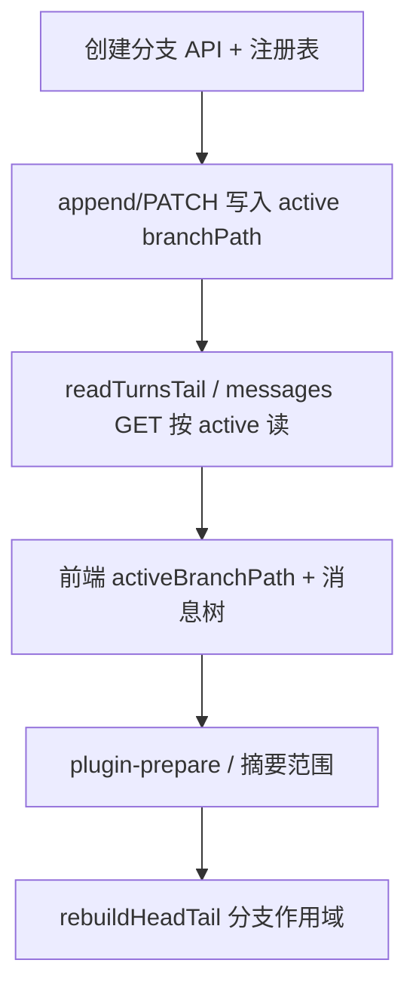

# 对话分支 — 设计与实现参考

> **状态（2026-06）**：**服务端 memory / 枚举原语已落地**（P3）；**分支创建、写入、切换 UI、assemble/history 按 active 路径读盘** 仍待产品实现。  
> **读者**：后续做「从此处分支继续」、消息树、分支切换的 Agent / 开发者。  
> **关联**：`DOC/03` §6.1–§6.4、§7.2–§7.3；`DOC/08` §1.2；`DOC/22` §5；`DOC/15` §0.7。

---

## 1. 产品语义

### 1.1 Swipe 与分支

| 概念 | 存储 | 说明 |
|------|------|------|
| **Swipe（重新生成）** | 同 turn 内 `receives[]` + `activeReceiveIndex` | 同一轮多次模型输出，**不**新建目录 |
| **分支（Branch）** | `meta.links.branches` + 子目录 `branch*/` | 从某 `turnId`（可选 `forkMessageId`）**另起一条对话线** |

用户显式「从某条消息分叉」时才写入 branch；不得与 swipe 混用同一存储路径。

### 1.2 `turnId` 与 `turnOrdinal`

- **`turnId`**：全局唯一、稳定；分叉引用、Lance PK、跨 chunk 定位均用此字段。
- **`turnOrdinal`**：仅在**同一条从根到叶的线性路径**上有「第 N 轮」含义（`DOC/03` §6.4）。

因此：

- 分支子目录内可与父目录**同名** `turn-000100-000199.json`，但 `turnOrdinal` / 正文属于该分支，**不得跨 `branchPath` 混读**。
- `maxOrdinalExclusive`（排除近期 history）、再生窗口、摘要 `fromTurn`/`toTurn` 必须基于 **当前 active 路径** 计算，不能跨分支比较 ordinal。
- Memory 向量行必须带 **`branchPath`**，否则同名 `chunkFileName` 无法消歧。

### 1.3 Active 分支与可见历史

用户在 UI 选中某条分支后，**可见对话** = 主路径从根到分叉点 + 该分支（及其祖先嵌套分支）上的 turn，**不是**全库所有分支的并集。

| 字段 | 位置 | 含义 |
|------|------|------|
| `activeBranchPath` | 会话根 `index.json`、`chat.index.json` 列表项 | 当前选中分支，会话根相对路径；主路径为 `""` 或省略 |
| 示例 | `"branch1"`、`"branch1/nested"` | 见 §2.1 目录布局 |

**Memory 召回（已实现）**：仅 `activeBranchPath` **及其祖先**（含主路径 `""`）上的 Lance 行参与 TopK。见 §5.2。

---

## 2. 磁盘布局

### 2.1 目录结构（示意）

```text
data/{userId}/chats/{conversationId}/
  index.json                    # 主路径 head/tail、branches[]、activeBranchPath
  turn-000000-000099.json       # 主路径 chunk（branchPath=""）
  turn-000100-000199.json
  branch1/
    index.json                  # 该分支子树的 head/tail、嵌套 branches[]
    turn-000100-000199.json     # 可与主路径同名；内容属 branch1
    branch1/                    # 嵌套分支
      index.json
      turn-000200-000299.json
  branch2/
    ...
```

读盘路径：`path.join(conversationDir(id), branchPath, chunkFileName)`，由 `chunkStorageRelativePath(branchPath, chunkFileName)` 生成相对路径。

### 2.2 Chunk `meta.links`

```json
{
  "meta": {
    "links": {
      "previous": "turn-000000-000099.json",
      "next": null,
      "branches": [
        {
          "forkTurnId": "a1b2c3d4",
          "forkMessageId": "optional-message-id",
          "path": "branch1",
          "label": "可选 UI 文案"
        }
      ]
    }
  },
  "turns": []
}
```

- `path`：**相对当前 chunk 所在目录**的子目录名（不是会话根绝对路径）。
- 嵌套时：父目录 `branch1/index.json` 的 `branches[].path` 为 `"branch1"` → 会话根相对全路径 `branch1/branch1`。

### 2.3 各级 `index.json`

| 文件 | 职责 |
|------|------|
| 会话根 `index.json` | 主路径 `headChunkFile` / `tailChunkFile`；`branches[]` 注册顶层分支；`activeBranchPath` |
| `branch*/index.json` | 该子树 head/tail；可嵌套 `branches[]`；字段形态与 §7.2 同形（`DOC/03` §7.3） |
| `chat.index.json` 列表项 | 含 `activeBranchPath` 供列表/路由展示（与根 index 宜保持一致） |

**权威链**：chunk 内 `meta.links.previous/next` 为准；各级 `index.json` head/tail 为加速索引，漂移时用 `rebuildHeadTailFromLinks` 修复（当前实现仅扫**主路径根目录** `turn-*.json`，分支需按 §6.2 扩展）。

---

## 3. Memory v2 与分支列

Lance 单表 `turn_memory` 行字段（`DOC/22` §4）：

| 列 | 主路径 | 分支 |
|----|--------|------|
| `turnId` | PK | 全局唯一 |
| `turnOrdinal` | 该路径 ordinal | 仅在同路径内有意义 |
| `branchPath` | `""` | 如 `"branch1"`、`"branch1/nested"` |
| `chunkFileName` | `turn-000000-000099.json` | **仅 basename**，不含目录前缀 |
| `vector` | embedding | — |

旧版 `mem_*` 多表**不兼容**；分支数据就绪后须 **重建远期记忆索引**。

---

## 4. 已实现的服务端原语（2026-06 · P3）

实现分支 UI 前可直接复用以下模块，**无需再改 Lance schema**。

### 4.1 路径规范化 — `server/src/chunk-path.ts`

| 函数 | 用途 |
|------|------|
| `normalizeBranchPath` | `""` \| `"branch1"` \| `"branch1/nested"`；拒绝 `..` |
| `normalizeChunkBasename` | 仅接受 `turn-XXXXXX-XXXXXX.json` |
| `chunkStorageRelativePath` | 拼磁盘相对路径 |
| `splitChunkStoragePath` | 拆分合并路径为 branch + basename |
| `chunkLocationKey` | 分组键（memory 批量读 chunk） |
| `branchAncestorPaths` | active 分支及祖先列表 |
| `buildAllowedBranchPathsForActive` | memory 召回过滤用 `Set` |
| `buildAllowedBranchPathsWhereSql` | Lance `.where()` 用 SQL（`branchPath = ''` 或 `IN (...)`） |
| `resolveNestedBranchPath` | 父 branchPath + 注册表相对 path → 全路径 |

单测：`server/src/chunk-path.test.ts`。

### 4.2 Chunk 读与枚举 — `server/src/chunk-chain.ts`

| 函数 | 用途 |
|------|------|
| `readChunkFileAt(convId, branchPath, basename)` | 按位置读 chunk |
| `parseBranchRegistryPath` | 解析 `branches[]` 单条 `.path` |
| `collectRegisteredBranchPaths` | 从各级 `index.json` 的 `branches[]` **递归**收集已注册分支 |
| `listChunkFileNamesAt(convId, branchPath)` | 沿该分支 tail → previous 列 basename |
| `listChunkFileNames` | 主路径快捷方式（`branchPath=""`） |
| `enumerateAllChunkChains` | 主路径 + 全部分支 → `{ branchPath, chunkFileName }[]` |

单测：`server/src/chunk-chain-branches.test.ts`（注册表解析）；`chunk-chain.test.ts`（主路径链）。

**注意**：枚举依赖 `branches[]` **注册表**；磁盘上存在但未注册的子目录**不会**被扫到（避免误扫垃圾目录）。创建分支时**必须**写入注册表。

### 4.3 分支 index 读 — `server/src/chat-storage.ts`

| 函数 / 字段 | 用途 |
|-------------|------|
| `ConversationIndex.activeBranchPath` | 当前 active 分支 |
| `ChatListEntry.activeBranchPath` | 列表同步字段 |
| `branchConversationIndexPath` | 分支 `index.json` 路径 |
| `readBranchConversationIndex` | 读分支子树 index |

`chatListEntryFromIndex` 会把合法 `activeBranchPath` 写入列表项。

### 4.4 Memory 管线 — 已接分支

| 模块 | 行为 |
|------|------|
| `memory-index.ts` | `plan` / `reindex` 用 `enumerateAllChunkChains`；单轮 upsert 支持 `branchPath`；tail 缓冲按分支 index 判断 |
| `memory-pipeline.ts` | `searchTurnMemoryVectors` 传入 `buildAllowedBranchPathsForActive(activeBranchPath)` |
| `chat-assemble.ts` | `runMemoryPipeline({ activeBranchPath: idx.activeBranchPath ?? '' })` |
| `memory-hits.ts` | 命中后按 `branchPath`+`chunkFileName` 批量 `readChunkFileAt` |
| `memory-tail-buffer.ts` | 缓冲键含 `branchPath` |
| `memory-store.ts` | `searchTurnMemoryVectors` + `buildMemoryVectorSearchWhereClause`；`replaceTurnMemoryIndex`；`deleteTurnMemoryByBranchSubtree` |

单测：`server/src/memory-store.test.ts`、`server/src/memory-index.test.ts`。

### 4.5 向量召回 Lance 查询（实现参考）

**入口**：`memory-pipeline.ts` → `searchTurnMemoryVectors(..., buildAllowedBranchPathsForActive(activeBranchPath))`。

**允许路径**（与 §5.2 表一致）由 `branchAncestorPaths` / `buildAllowedBranchPathsForActive` 生成；**不含兄弟分支**。

**查询顺序**（`memory-store.ts`）：

```text
openMemoryTable(turn_memory)
  → vectorSearch(queryVector)
  → .where(buildMemoryVectorSearchWhereClause(...))   // 可选
  → .limit(k)                                        // k ≤ 64
  → toArray()
  → collectSearchHits（turnId 去重、excludeTurnIds、兜底过滤）
  → TopK
```

**`.where` 示例**（`activeBranchPath = "branch1/nested"`，`minRecentOrdinal = 42`）：

```sql
branchPath IN ('', 'branch1', 'branch1/nested') AND turnOrdinal < 42
```

主路径仅 `branchPath = ''`。全库召回传 `allowedBranchPaths: undefined`，不对 `branchPath` 加 where。

**为何 Lance 预过滤**：若先全表 TopK 再内存过滤，兄弟分支向量相似度高时会挤占 `limit` 槽位，导致允许路径内命中 **&lt; memoryTopK**。预过滤后 TopK 只在当前分支链内排序。

**读盘消歧**：命中后必须用 `memory-hits.ts` → `readChunkFileAt(convId, hit.branchPath, hit.chunkFileName)`；**勿**使用已删除的 `turn-resolve.ts` 链式扫盘。

---

## 5. 行为定案

### 5.1 全量 memory 重建

```text
clearConversationMemoryBuffers(conversationId)     // 仅清尾块缓冲，不删 Lance 表
enumerateAllChunkChains(conversationId)
  → 对每个 { branchPath, chunkFileName }
      readChunkFileAt → filterEmbeddableTurns
  → embedTextsInBatches（全部语料）
  → 若 embed 失败：返回错误，**旧 turn_memory 表保留**
  → 若 embed 成功：replaceTurnMemoryIndex（delete + 批量 create/mergeInsert）
  → optimizeTurnMemoryTable
  → reindexLorebooksByIds（绑定资料库）
```

与主路径重建共用 SSE `memory/rebuild?stream=1`；无需按分支单独 API。

**失败窗口**：重建在 embedding API 失败时**不再**先 `wipe` 再 embed，避免索引暂空。成功路径由 `replaceTurnMemoryIndex` 一次性替换表内容。

### 5.2 向量召回范围（默认）

| `activeBranchPath` | 允许的 `branchPath` |
|--------------------|---------------------|
| `""` / 省略 | 仅 `""` |
| `branch1` | `""`, `branch1` |
| `branch1/nested` | `""`, `branch1`, `branch1/nested` |

**不含**兄弟分支（如 `branch2`）。`searchTurnMemoryVectors` 在 Lance `vectorSearch` 上通过 `.where(branchPath IN (...))`（及 `turnOrdinal < minRecent`）**预过滤**，TopK 只在允许路径内排序，避免兄弟分支挤占 limit 槽位。内存侧 `collectSearchHits` 仍保留同条件作兜底。

若产品需要「全库召回」，须显式开关并传 `allowedBranchPaths: undefined`（不传则不对 `branchPath` 预过滤）。

### 5.3 弃用分支

1. 删除子树 JSON 与目录（产品流程）。
2. 从父级 `branches[]` 移除注册项。
3. 调用 `deleteTurnMemoryByBranchSubtree(conversationId, branchPath)`。
4. 若用户仍在该分支，将 `activeBranchPath` 重置到父路径或主路径。

---

## 6. 待实现清单（产品 / 读写路径）

以下为主路径已实现、**分支尚未接入**的能力；做分支 UI 时按此顺序打通。

### 6.1 写入路径（高优先级）

| 项 | 说明 | 参考 |
|----|------|------|
| **创建分支 API** | 从 `forkTurnId` 复制/截断子树到 `branchN/`；写父 chunk `meta.links.branches`；写子目录 `index.json` + 首 chunk | `DOC/03` §6.3 |
| **`writeChunkFile` 分支感知** | 写入 `branchPath/xxx.json` 前 `mkdir(dirname, { recursive: true })` | `DOC/22` §5.5 |
| **`appendConversationTurn` 分支上下文** | 追加轮写入 **active** 分支 tail，而非始终主路径 | `chunk-chain.prepareTailChunkForAppend` 需接受 `branchPath` |
| **`scheduleMemoryIndexUpsert`** | 落盘时传入正确 `branchPath`（函数已支持第 4 参数） | `memory-index.ts` |
| **注册表一致性** | 创建/删除分支时更新各级 `branches[]` | §2.3 |

### 6.2 读取路径（assemble / UI）

| 项 | 当前状态 | 目标 |
|----|----------|------|
| `readTurnsTail` / `readTurnsInOrdinalRange` | 仅主路径 `index.tailChunkFile` | 接受 `branchPath`，读 `readBranchConversationIndex` |
| `loadTurnsForMemoryPipeline` | 主路径 tail/区间 | active 路径上的 tail + ordinal 窗口 |
| `GET .../messages` | 全链或区间（主路径） | 支持 `?branchPath=` 或隐含 active；分页见 `DOC/15` |
| `plugin-prepare-context` | 主路径区间读 | 摘要范围限定在 active 路径 |
| PATCH turns / 按 turnId 定位 | 主路径 `readAllTurns` 或链扫 | 已知 `branchPath` 时 `readChunkFileAt` 缩小范围（`turn-resolve.ts` 已移除） |

### 6.3 索引修复

| 项 | 说明 |
|----|------|
| `rebuildHeadTailFromLinks` | 扩展为按 `branchPath` 作用域扫描（主路径只扫根目录 `turn-*.json`；分支只扫对应子目录） |
| `syncChunkIndexIfDrifted` | 分支 tail 变更后按需失效缓存 `invalidateChunkIndexSyncCache` |

### 6.4 API 与前端

| 项 | 说明 |
|----|------|
| `PATCH .../conversations/:id` | 支持 `activeBranchPath` 更新（字段已存在于 `ConversationIndex`） |
| 消息树 UI | `DOC/04`「消息树 / 分支 UI」 |
| 分支切换 | 切换后重载 messages、memory 召回自动随 `activeBranchPath` 过滤（assemble 已接） |
| Lazy load | 分支分页读：`DOC/15` §0.7 — 在 `readTurnsTail` 分支化后实施 S2–S4 |

---

## 7. 推荐实施顺序



1. **只读验证**：手工在磁盘放置 `branch1/` 测试数据 → `enumerateAllChunkChains` + 重建 memory → assemble 设 `activeBranchPath` 验证召回。
2. **写入闭环**：创建分支 + 在分支上追加 1 轮 → 检查 Lance 行 `branchPath`、chunk 路径、注册表。
3. **UI**：切换分支 → messages 列表与 composer 仅显示 active 路径历史。

---

## 8. 测试建议

| 类型 | 内容 |
|------|------|
| 单测（已有） | `chunk-path.test.ts`（含 `buildAllowedBranchPathsWhereSql`）、`chunk-chain-branches.test.ts`、`chunk-chain.test.ts`、`memory-store.test.ts`（`buildMemoryVectorSearchWhereClause`）、`memory-index.test.ts`（`filterEmbeddableTurns`） |
| 单测（待加） | `listChunkFileNamesAt` 用临时目录 fixture；`replaceTurnMemoryIndex` / Lance 集成（可选） |
| 集成 | 手工分支目录 + `reindexConversationMemory` 行数 = 各路径可 embed turn 之和；embed 失败后会话仍有旧索引 |
| 回归 | 主路径会话 `activeBranchPath=""` 行为与改前一致；向量召回不含兄弟 `branchPath` |

---

## 9. 常见陷阱

1. **混读同名 chunk 文件**：必须用 `readChunkFileAt(convId, branchPath, basename)`，禁止仅用 basename 调 `readChunkFile`。
2. **忘记写 `branches[]`**：`enumerateAllChunkChains` 不会发现未注册目录。
3. **跨分支比 ordinal**：再生 / history 窗口 / `minRecentOrdinal` 必须基于 active 路径上的 turn 集合。
4. **tail 缓冲作用域**：`queueTurnMemoryUpsert` 的 `isTail` 须用**该 branchPath 对应**的 index.tailChunkFile 判断。
5. **列表与根 index 漂移**：更新 `activeBranchPath` 时同时写会话根 `index.json` 与 `chat.index.json`（经 `upsertChatListEntry`）。

---

## 10. 文件速查

| 区域 | 路径 |
|------|------|
| 分支路径工具 | `server/src/chunk-path.ts` |
| 分支链枚举 | `server/src/chunk-chain.ts` |
| 分支 index | `server/src/chat-storage.ts` |
| Memory 重建 | `server/src/memory-index.ts`（`replaceTurnMemoryIndex`） |
| Memory 召回 / Lance where | `server/src/memory-pipeline.ts`、`server/src/memory-store.ts` |
| 命中批量读 | `server/src/memory-hits.ts`（替代原 `turn-resolve.ts`） |
| 单测 | `memory-store.test.ts`、`memory-index.test.ts` |
| Assemble 入口 | `server/src/chat-assemble.ts` |
| 性能 / schema 背景 | `DOC/22-performance-audit-and-optimization.md` §5 |
| 消息懒加载与分支 | `DOC/15-conversation-messages-lazy-load.md` §0.7 |
| Chunk 主路径（已实现） | `DOC/08-chunk-chain-implementation.md` |

---

## 11. 修订记录

| 日期 | 说明 |
|------|------|
| 2026-06 | 初版：汇总 P3 已实现原语 + 产品语义 + 待办清单，供分支功能开发对照 |
| 2026-06 | §4.5 Lance 预过滤实现参考；§5.1 embed 成功后 `replaceTurnMemoryIndex`；移除 `turn-resolve.ts` |
