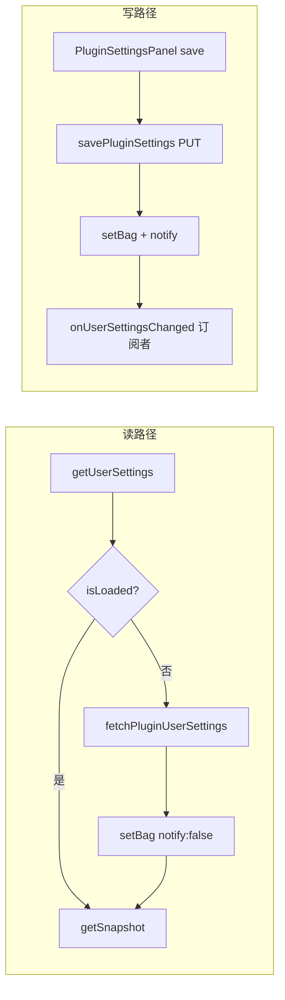

# 全局插件 settings 缓存与订阅（`getUserSettings`）

> **状态**：**已实现**（2026-06-18 · commit `a7ca4ea`）  
> **关联**：`DOC/04` P0、`DOC/18` §3.10、`DOC/21`（会话 settings 已落地模式）、`DOC/30` trace-keeper 侧栏 refresh、`DOC/11` §6 Web 宿主清单  
> **非目标**：服务端 chat 组装路径的 `readMergedPluginUserSettings` 磁盘读优化（另线，见 §7）

---

## 1. 问题

### 1.1 现象

插件 scoped host 的 `host.plugins.getUserSettings()` **每次调用**都会 `GET /api/plugins/:pluginId/settings`，与会话侧 `getPluginSettings()` 的「已加载则 snapshot」行为不一致。

典型热点：`trace-keeper` 的 `refreshPanel` 在 `onTurnDataChanged`、`onGeneratingChanged`、`onPluginSettingsChanged` 等事件中并行读取 global + conv settings。chat 等待/流式期间 conv 已命中 Pinia cache，**global 仍反复 HTTP GET**。

### 1.2 与「chat 期间多次 settings 请求」的关系

| 路径 | 说明 |
|------|------|
| 前端 `GET …/plugins/:id/settings` | 本文档范围；侧栏 UI refresh 导致 |
| 服务端提示词组装 | Node 内读用户 `settings.json`，**不走**上述 HTTP |

---

## 2. 定案原则

| 原则 | 定案 |
|------|------|
| 模式 | **对齐** `conversation-plugin-settings` store：内存 snapshot + 写时失效 + 订阅推送 |
| 不用纯 TTL | settings 写少读多；TTL 无法兼顾「chat 少请求」与「保存后立即一致」 |
| 保存路径零 GET | 设置页 PUT 成功后把 **响应 body** 写入 cache 并 notify，禁止订阅回调里再 fetch |
| 插件透明 | 优先在 **Web host 层**实现；插件继续调用 `getUserSettings()` 即可获益 |
| 对称 API | 与会话侧一致：`getUserSettings` / `getUserSettingsSnapshot` / `onUserSettingsChanged` |

---

## 3. 现状（实现前）

| API | 当前行为 | 目标行为 |
|-----|----------|----------|
| `conversation.getPluginSettings()` | store 已加载 → 同步 snapshot | 不变 |
| `conversation.getPluginSettingsSnapshot()` | 同步读 | 不变 |
| `conversation.onPluginSettingsChanged()` | store.subscribe | 不变 |
| `plugins.getUserSettings()` | 每次 HTTP GET | 已加载 → snapshot；未加载 → GET 一次 + setBag |
| `plugins.getUserSettingsSnapshot()` | **不存在** | 新增；未加载返回 `{}` |
| `plugins.onUserSettingsChanged()` | 已有；notify 后 **再 GET** | subscribe；notify 时携带已保存 settings |

**已有但未接线的部分**：

- `web/src/utils/plugin-user-settings-events.ts` — `subscribePluginUserSettingsSaved` / `notifyPluginUserSettingsSaved`
- `PluginSettingsPanel.vue` 保存后 `notifyPluginUserSettingsSaved(plugin.id)`（仅传 id）
- `custom-styles` 已订阅 `onUserSettingsChanged`，但 `applyStyles` 内仍会双 fetch

**参考实现**：`web/src/stores/conversation-plugin-settings.ts`、`createScopedPluginHost` 内 `conversation.getPluginSettings` 分支。

---

## 4. 目标架构



### 4.1 新增 store

建议：`web/src/stores/plugin-user-settings.ts`（Pinia，与会话 store 同构）

| 方法 | 说明 |
|------|------|
| `isLoaded(pluginId)` | 是否已从网络或保存路径灌入 |
| `getSnapshot(pluginId)` | 浅拷贝 `{}` 默认 |
| `setBag(pluginId, settings, opts?)` | `markLoaded` + 可选 `notify` |
| `subscribe(pluginId, handler)` | 返回 unsubscribe |
| `clearAll()` | 登出 / 切换用户时清空 |

**并发去重（建议）**：同一 `pluginId` 并发 `getUserSettings` 共享 in-flight `Promise`，避免挂载风暴。

### 4.2 改 scoped host（`create-plugin-web-host.ts`）

```typescript
plugins: {
  getUserSettings() {
    const store = usePluginUserSettingsStore()
    if (store.isLoaded(id)) {
      return Promise.resolve(store.getSnapshot(id))
    }
    // fetch → setBag(id, s, { notify: false }) → return s
  },
  getUserSettingsSnapshot() {
    return usePluginUserSettingsStore().getSnapshot(id)
  },
  onUserSettingsChanged(handler) {
    return usePluginUserSettingsStore().subscribe(id, handler)
  },
}
```

### 4.3 改保存通知

`notifyPluginUserSettingsSaved(pluginId, settings?)`：

- 若传入 `settings`：`setBag` + notify（**零 GET**）
- 若仅 `pluginId`（兼容旧调用）：可 `invalidate` 后单次 fetch，或 v1 要求调用方必传 settings

`PluginSettingsPanel.submitSettings`：

```typescript
settingsModel.value = await savePluginSettings(plugin.id, settingsModel.value)
notifyPluginUserSettingsSaved(plugin.id, settingsModel.value)
```

### 4.4 失效策略

| 事件 | 动作 |
|------|------|
| 设置页 PUT 成功 | `setBag` + notify |
| 用户登出 / 切换账号 | `clearAll()`（需在 auth 流程挂 hook） |
| 多标签页 | v1 不保证；可选后续 `BroadcastChannel` |
| 调试强制刷新 | 可选 `plugins.invalidateUserSettings()` |

---

## 5. 插件侧建议（实现后）

| 场景 | 用法 |
|------|------|
| 注册 lifecycle | `onUserSettingsChanged(() => refresh…)` |
| 高频 refresh（turn / generating） | global 未变时优先 `getUserSettingsSnapshot()`；conv 继续用现有 snapshot |
| 首次 / 不确定是否加载 | `await getUserSettings()` |

**trace-keeper（P0 验收之一）**：已补 `host.plugins.onUserSettingsChanged?.(() => refreshPanel)`；`getUserSettings` 命中 Pinia 缓存。

**custom-styles**：保留双订阅；host 缓存后 `applyStyles` 内 GET 次数应降为 0（已加载时）。

---

## 6. 实现清单

- [x] `web/src/stores/plugin-user-settings.ts`
- [x] `createScopedPluginHost`：`getUserSettings` / `getUserSettingsSnapshot` / 改 `onUserSettingsChanged`
- [x] `plugin-user-settings-events.ts`：notify 携带 optional settings → store
- [x] `PluginSettingsPanel.vue`：保存后传入 settings
- [x] `web/src/plugins/types.ts` + `DOC/18` §3.10：文档化 snapshot API
- [x] auth 登出：`clearAll()`（与会话 plugin settings 清理一并评估）
- [x] `trace-keeper`：补 `onUserSettingsChanged` 订阅
- [x] 单测：store + host 命中 cache / notify / in-flight 去重

**验收**：

1. 打开 trace-keeper 侧栏对话，普通 chat 等待期间 DevTools **无重复** `GET /api/plugins/trace-keeper/settings`（仅首屏或保存后预期请求）。
2. 系统设置 → 插件 → 修改 trace-keeper 全局项 → 保存后侧栏/样式 **无需刷新页面** 即更新。
3. `custom-styles` 改全局 CSS 字段后即时生效。

---

## 7. 与服务端组装的关系

服务端 `readMergedPluginUserSettings`（`server/src/plugin-system/settings.ts`）读磁盘 JSON，用于 **chat complete 组装**，与浏览器 `GET /api/plugins/:id/settings` 无关。若未来要优化服务端重复读盘，单独评估进程内 LRU / mtime 缓存，**不在本文档范围**。

---

## 8. 参考（当前代码）

| 路径 | 说明 |
|------|------|
| `web/src/stores/conversation-plugin-settings.ts` | 会话 settings store 模板 |
| `web/src/plugins/create-plugin-web-host.ts` | scoped host；L207–218 `plugins` |
| `web/src/utils/plugin-user-settings-events.ts` | 保存事件总线 |
| `web/src/components/settings/PluginSettingsPanel.vue` | 全局 settings 保存 UI |
| `plugins/trace-keeper/src/index.ts` | `refreshPanel` 双 fetch 热点 |
| `plugins/custom-styles` | 已用 `onUserSettingsChanged` 范例 |
