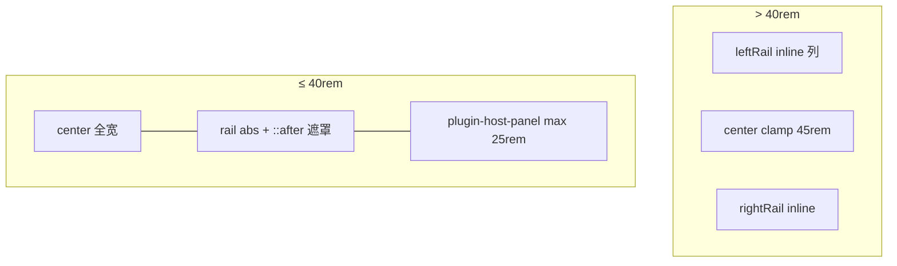

# 移动端兼容性修复

> **状态**：**Phase 1 布局已落地**（2026-06-19）；composer / 安全区 / 软键盘验收仍待做  
> **关联**：`DOC/04` P0、`DOC/31` §6.3、`DOC/03` §11.2、`web/src/App.vue`、`web/src/style.css`  
> **非目标**：原生 App / PWA 离线、触控手势库全量替换、平板横屏专属 UX（可 Phase 2）

---

## 1. 背景

桌面以三列 Grid 为主（`DOC/31`）：

```text
grid-template-columns: 1fr clamp(45rem, 60%, 80rem) 1fr
```

窄屏（≤40rem）原先问题：中间列 `clamp(45rem, …)` 最小 720px 溢出；侧栏占列宽且无 overlay。

---

## 2. 定案（Phase 1 · 已实现）

| 项 | 定案 |
|----|------|
| **断点** | 全站统一 **`40rem`（640px）** — `@media (max-width: 40rem)`；顶栏移动菜单同断点（不再用 Vuetify `sm` / `600px`） |
| **Grid** | **`1fr` 单列**（rail `absolute` 脱流后不占列）；`#centerRail` **留在文档流**，由 `v-main` 自然落在 app-bar 下方 |
| **Rail 容器** | 关闭：`absolute; inset:0`（相对 `.main-chat`）；打开：`fixed` + `--header-height` / `--footer-height`，`z-index: 1005` |
| **遮罩** | rail **`:has(.plugin-host-panel:not(.hidden))::after`** 全屏半透明 |
| **插件面板** | `.plugin-host-panel`：**`max-width: 25rem`**，左 rail 贴左、右 rail 贴右；非中间列宽度 |
| **JS 改动** | **仅** `plugin-panel-registry.ts`：侧栏 `hidden` **localStorage 持久化**；布局纯 CSS |
| **打开侧栏** | 任意插件入口均可：`host.ui.panel.open`、rail Tab、页脚「插件」等（registry 现有逻辑不变） |
| **关闭侧栏** | rail 头栏 pin/隐藏（`setHidden(true)`） |
| **默认可见** | 无持久化记录时 **`leftRail` / `rightRail` 均为 hidden**；刷新后恢复上次状态，不每次默认打开 |
| **持久化键** | `arousal-plugin-panel-hidden`（设备 UI 偏好，登出保留） |

---

## 3. 目标架构



```text
≤40rem · 侧栏打开时：

┌──────────────── viewport ────────────────┐
│┌─ panel ≤25rem ─┐                         │
││ PluginRailHost  │  dim（::after）         │
│└────────────────┘                         │
└──────────────────────────────────────────┘
```

---

## 4. 实现清单

### Phase 1（布局 · 已做）

- [x] `App.vue`：`≤40rem` grid 零列 + rail abs + `::after` + panel `max-width: 25rem`
- [x] `style.css` / 各视图 scattered `@media` → **40rem**
- [x] 顶栏移动菜单断点 **40rem**（替换 `d-sm-none` / `600px`）
- [x] `plugin-panel-registry.ts`：`hidden` localStorage 持久化

### Phase 1（仍待做）

- [ ] **iOS 软键盘 / 底部空白**（2026-06-25 友测 · 详见 **§6**）
- [ ] `safe-area-inset`：顶栏 / 页脚 / composer 统一
- [ ] 库页移动布局专项（Phase 2 可拆）

### Phase 2（可选）

- [ ] Tablet 双列简化
- [ ] 持久化 active tab（当前仅 hidden）

---

## 5. 验收标准

| # | 场景 | 期望 |
|---|------|------|
| 1 | 375px 进入 `/chat/:id` | 无横滚；默认侧栏关则全宽对话 |
| 2 | trace-keeper slot / `open` | 打开左 rail overlay（≤25rem）+ 遮罩 |
| 3 | pin 关闭后再刷新 | 仍关闭（localStorage） |
| 4 | pin 关闭后再点插件 | 再次打开并持久化 |
| 5 | iOS Safari / Android | composer 可读写（待专项验收） |
| 6 | iOS Safari 对话页 · 键盘 | composer 贴键盘上沿，无大块空白；`app-footer` 与 Safari 底栏不叠黑区（§6） |

---

## 6. iOS 软键盘 / 底部空白（2026-06-25 · 友测 · 待修）

### 6.1 现象

| 状态 | 表现 |
|------|------|
| 键盘未弹出 | `v-footer.app-footer`（Arousal Pub）下方至 Safari 浏览器底栏之间有大块空白（同主题黑底） |
| 键盘弹出 | `.chat-footer`（输入框 + 工具栏）与软键盘之间仍有空白；中间可见 Safari 密码/自动填充 accessory、蓝色键盘切换按钮 |

### 6.2 当前布局（相关文件）

```text
.v-application__wrap     height: 100dvh; overflow: hidden   ← style.css
├── v-app-bar (app)
├── v-main.main-chat
│   └── .chat-session
│       ├── ChatMessageList
│       └── .chat-footer / ChatComposer
└── v-footer.app-footer (app)   ← 与 composer 双层底栏
```

- `web/index.html`：`viewport` 仅 `width=device-width, initial-scale=1.0`，无 `interactive-widget`
- `syncAppChromeCssVars`（`App.vue`）：`ResizeObserver` 量顶/底栏 DOM 高，**不**监听 `visualViewport`
- `.chat-footer` 有 `env(safe-area-inset-bottom)`；`.app-footer` **无**

### 6.3 根因判断

1. **主因**：整页高度锚定 **layout viewport**（`100dvh`），iOS 键盘弹出时 **visual viewport** 缩短，但 `v-main` 仍按全屏 − 顶栏 − 底栏计算；composer 在 `v-main` 文档流底部，无法贴键盘上沿。
2. **次因**：`v-footer.app` 固定在 layout 底部，与 `.chat-footer` 叠占垂直空间。
3. **次因**：`100dvh` 在 iOS Safari 可能大于当前可见区（动态地址栏/底栏），键盘未弹出时页脚下方亦可能出现「多出来的」黑区。
4. **缺失**：无 `visualViewport` 适配；viewport meta 未声明键盘 resize 行为。

### 6.4 建议修复顺序（未开工）

| 步 | 动作 |
|----|------|
| 1 | `index.html` 试 `interactive-widget=resizes-content`（iOS 16+） |
| 2 | `visualViewport` 写 `--app-height` / `offsetTop`，替换或辅助 `100dvh` |
| 3 | 移动端 `/chat/:id` 隐藏或折叠 `app-footer`，仅保留 composer |
| 4 | 顶栏 / `app-footer` / `.chat-footer` 统一 `safe-area-inset-*` |
| 5 | 验收：iOS Safari × 键盘开/关 × 地址栏显/隐 × 竖屏 |

### 6.5 非目标（本轮）

- Composer `position: fixed` 贴 visual 底（与 virtua 滚动联动复杂，作备选）
- 原生 App / PWA

---

## 7. 参考

| 路径 | 说明 |
|------|------|
| `web/src/App.vue` | `.main-chat` grid / 窄屏 rail |
| `web/src/style.css` | `--app-breakpoint-narrow: 40rem`、dialog 窄屏宽度 |
| `web/src/plugins/plugin-panel-registry.ts` | `hidden` 持久化 |
| `DOC/31-main-layout-plugin-rails.md` | 桌面三列 + §6.3 窄屏 |

---

## 8. 变更记录

| 日期 | 说明 |
|------|------|
| 2026-06-19 | 立项 P0 |
| 2026-06-19 | 定案：40rem、零列 grid、rail abs、`::after`、panel 25rem、hidden 持久化；Phase 1 布局落地 |
| 2026-06-25 | iOS 友测：软键盘 / 底部空白；分析记入 §6、`DOC/04` P0 |
